# Form Setup for Visitor Check-in system

This is the more complicated set up - once this is done, most of the set up is done.

Head to Google Drive, and pick New -> More -> Google Forms:

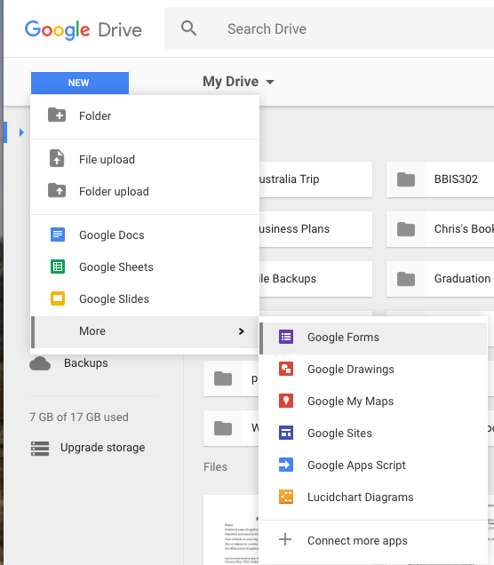

This will take you to an Untitled form. You can now lay out the form however you want - there are only two key requirements we have:

1. You MUST have a field for collecting the visitor's name. It can be labelled however you want, but must be a "Short Answer" field. It can either inside or outside another form section, it's up to you:
  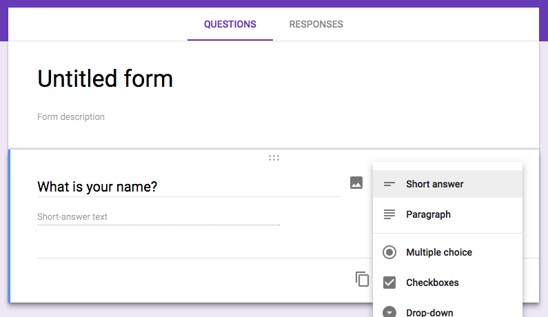

2. You MUST have a multi-choice question for prompting the visitor to select who they are here to see. You can put some values in if you want, but when you do the spreadsheet set up, these values will be replaced with the values from your spreadsheet. If you add the option to have an 'Other' field, then just the channel Slack message will be sent.
  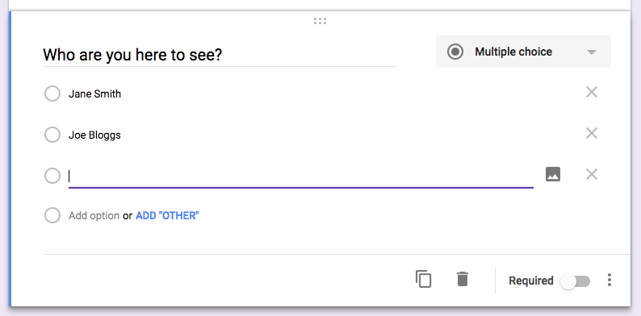

You'll also want to create a spreadsheet to record responses in. You can do this by going to the "Responses" tab and hitting the green icon with the white cross - it changes to say "Create Spreadsheet" when hovered. You need to do this because we will be setting up this spreadsheet to contain a list of "hosts".

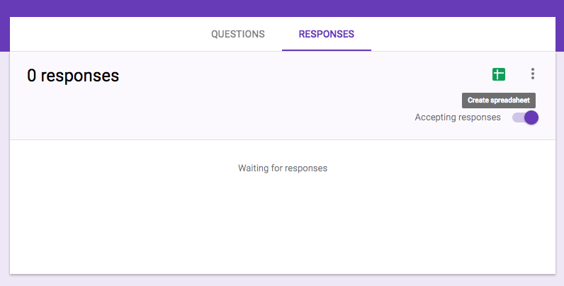

Now it's time to set up the script associated with the form. To do this, hit the icon with 3 vertical dots, and select "Script Editor". This will open in a new tab - keep the form tab open, we'll need to get some IDs from it.

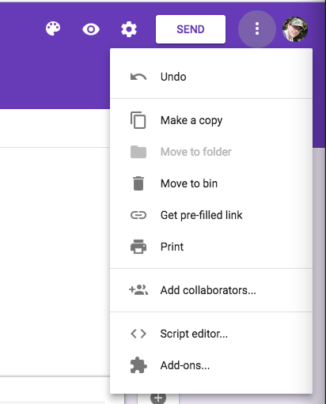

When the script editor has opened, it will have a 'Code.gs' file with an empty function declared. You should replace that script with the contents of `form-script.gs` from this repo. The script is about 80 lines long, and it's probably a good idea if you have a read through now to understand what it does. To summarize, it takes a form submission, grabs the visitor and host names, and sends a slack message to the channel and the Slack username, which it tries to figure out from the provided host's name (by looking up the "Staff Members" spreadsheet with names and corresponding Slack usernames).

We'll need to configure the project a bit next, so we should save it. Where it says "Untitled Project" in the top left corner, provide a name, and hit Save.

You'll see the script is scattered with `PropertiesService.getScriptProperties().getProperty` calls. We've put as much into configuration like this as possible so that, to start with, all you need to do is provide your own configuration. Let's add that now by selecting File -> Project Properties -> Script Properties. You'll see there are currently no configured properties, let's add some:

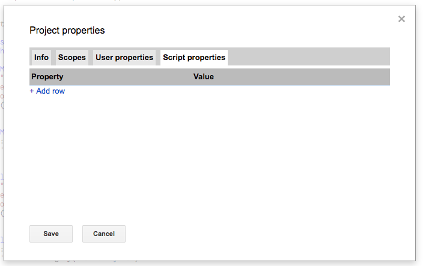

* **GUEST_NAME_FORM_ITEM_ID**: The form item IDs are the hardest things to get a hold of, because Google Forms does not make them very obvious. You'll need to be familiar with Chrome's devtools to do this. Right click on the field you added a few steps ago for collecting the visitor name - the easiest bit to start from is the actual input saying "Short-answer text".

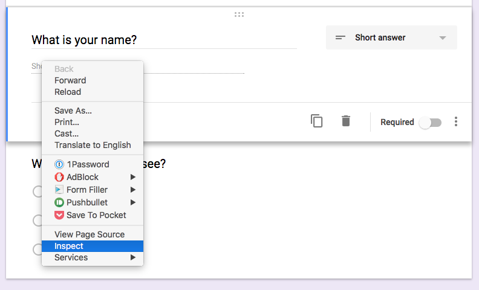

Once you've got the dev tools open and inspecting that element, you need need to look back up the 'tree' of elements. You'll see a bunch of elements with `jscontroller` attributes. You're looking for an attribute called `data-item-id`. When you find that attribute, copy it out of the attribute, head back over to the form script properties and provide it in the script properties, under the key `GUEST_NAME_FORM_ITEM_ID`:

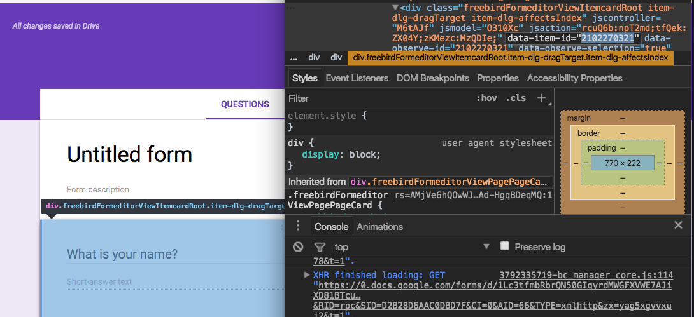

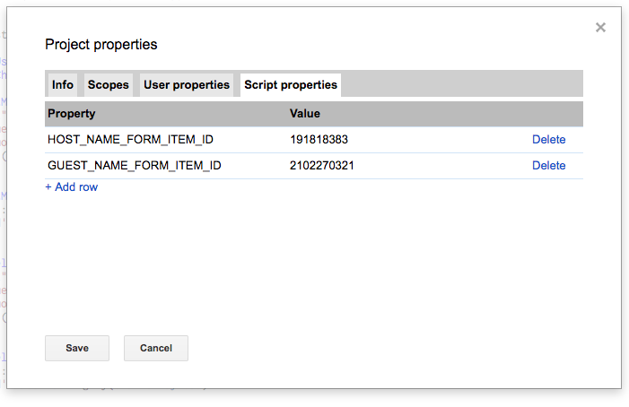

* **HOST_NAME_FORM_ITEM_ID**: The host name process is exactly the same, but for the host name question. Just inspect part of that question, and browse up the tree to find the `data-item-id` attribute. Once you've got it, add it to your script's properties under the key `HOST_NAME_FORM_ITEM_ID`.

Both of these keys are needed because when Google Forms makes a submission, it calls the script with the responses that are keyed by this ID - because the IDs are different for each form, we need them to be in the configuration so that we can look up the entered value for these questions.

* **STAFF_MEMBERS_SPREADSHEET_ID**: When you created the spreadsheet to store form responses earlier, that will have opened in a new tab. You'll need the ID of this spreadsheet because we expect to be able to look up a sheet in this spreadsheet called "Staff Members" that has a list of people names and their corresponding Slack names, so we know who to message when a visitor arrives. You don't need to create this sheet yet - we'll do this as part of the spreadsheet set up process, but you can if you want to. The main thing to get is the ID, which you can get from the URL. The ID is the part of the URL between "/spreadsheets/d/" and "/edit". Copy and paste this into the script properties under the key `STAFF_MEMBERS_SPREADSHEET_ID`.

* **SLACK_WEBHOOK_URL**: the Slack set up is pretty simple. You'll need to log in to Slack, and have permissions to set up a webhook. To set up the webhook, you can head to [Slack](https://my.slack.com/services/new/incoming-webhook/) to start the process. You'll need to either select an existing channel, or create a new one. In the screenshot below, I created a new channel for testing this process:

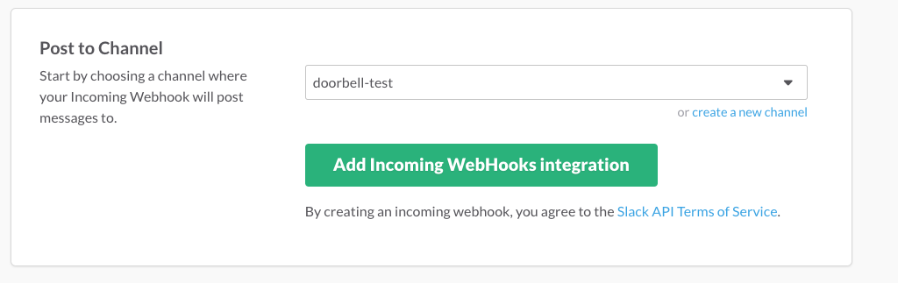

Once you hit the big green button, your webhook will be created. You really only need one thing from this form - the Webhook URL. Copy that, and paste it in the script properties, under the key `SLACK_WEBHOOK_URL`.

* **SLACK_USERNAME**: Finally, an easy one! This is "who" you want your visitor notifications to come from. It can be absolutely anything you want, it doesn't have to be a Slack username. This goes in the script properties as well, under `SLACK_USERNAME`.
* **SLACK_CHANNEL**: The channel where you would like visitor notifications to be posted to. This should be the channel you created the web hook for - for example, per my screenshot above, this would be "#doorbell-test". Once again, this goes into the script properties as `SLACK_CHANNEL`.

Once all these settings are in, there's just one more thing to do. We need to set up a "trigger" so that the function to extract form responses and send Slack messages will actually be sent. To do this, on the Script page, go to Resources -> Current project's triggers. Click on the link to add a trigger, and the default values should basically be good to go - "Run" should be set to "handleFormSubmission", "Events" should be set to "From form", and the event should be "On form submit". Once you've checked that's good, hit "Save".

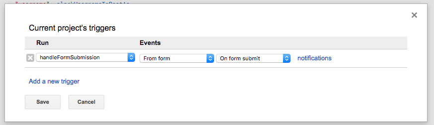

Once the trigger is done, you're all done here. You'll still need to set up the spreadsheet, but the form with it's response integration and Slack messaging is good to go!
