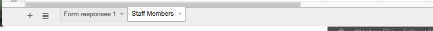
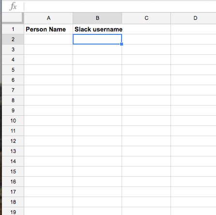
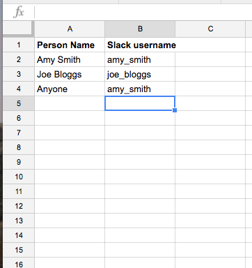
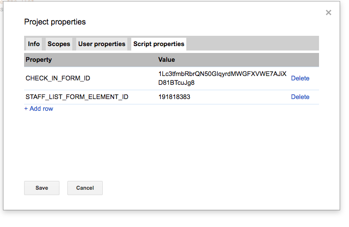
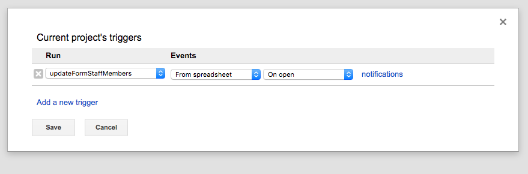

# Spreadsheet Set up

> Note: You need to set up the form before you can set up the spreadsheet. This is because the form will automatically create a spreadsheet to record responses in. You should already have the spreadsheet open when you set up the form - if not, find it in your Drive.

The spreadsheet set up is actually very easy. We're going to add a new sheet to record the mapping between person names we should show in our form, and the corresponding Slack names, and then add a single function to the Spreadsheet script (which is a different script project than the form), which will update the form multi-choice question each time the list of staff is changed.

To add a sheet, just hit the "+" icon in the bottom left corner of the screen, and rename the sheet to "Staff Members" - this name is quite important, as it is the name the form script looks for when looking up which Slack user to message. Because Google Forms created this spreadsheet, there will already be a sheet named "Form responses 1" - make sure you leave this sheet in place.

Both the spreadsheet script and form script expect headers to be present, so you should either put headers in (it doesn't matter what they are), or leave the first row blank. Here's the sheet I'm setting up:

Once this is done, you can put whatever people names and Slack names in as you want. You can have as many as you want, just remember that all these options are being put in a multi-choice radio button question. You can repeat Slack usernames more than once, for example if you want to have a specific person's name as well as a 'catch-all' entry that goes to that person as well. Here's my sheet:

This is all the data entry - now it's time to add the apps script. You get to this by hitting Tools -> Script Editor, which will open a new script project. Once again, put in a project name (e.g. "Check-in system responses scripts" and save).

The script you need to put in is found in the 'spreadsheets' directory of this repo, and is named 'spreadsheet-script.gs'. You can just paste it into the default 'Code.gs' file in the script project if you wish.

There's just two script settings you need to provide for this script - a welcome change after all the settings required by the form script.

1. **CHECK_IN_FORM_ID**: This is the ID of the form corresponding to this spreadsheet. Hopefully you still have it open in a tab somewhere, otherwise you'll need to find the form in your Drive. Just like when you got the ID of your spreadsheet during the form set up, the ID of the form can be derived from it's URL - it's between the "/forms/d/" and "/edit". You need to put this into your script properties under the key `CHECK_IN_FORM_ID`.

2. **STAFF_LIST_FORM_ELEMENT_ID**: This is the ID of the multi-choice question that should be populated with the list of people you just created in your spreadsheet. Normally we'd have to use Chrome's developer tools to get this again, but we actually already have it in our forms script! It is in the script properties for that project, under the key `HOST_NAME_FORM_ITEM_ID`. Simply copy that value, switch back to your Spreadsheet script project, and paste the value into that project's script properties, under the key: `STAFF_LIST_FORM_ELEMENT_ID`.

That's all the config! Here is mine, as an example:

Just like the form script, the last step is to set up a trigger for the project. We do this by going to Resources -> Current Project's Triggers, clicking the link to create a new trigger, and setting up the trigger. Unlike the form trigger, we need to change the trigger in this script:

* **Run**: keep this set to "updateFormStaffMembers"
* **Events**: change to "From spreadsheet"
* The default event for "From spreadsheet" is "On open" - instead, change this to "On change".

Once this is all set up, hit "Save" to create the trigger. You might be taken through an authorization process, as the script needs access to the spreadsheet to observe it for changes.

Now you can test things out! First, try reloading your form, and check that all the people you put into the spreadsheet are there. Then you can go back to your spreadsheet and try adding, editing or removing people from the list - changes should be reflected once the spreadsheet has saved.

Once your person question is working nicely, you can try submitting the form - if you look in your Slack client, you should see messages coming into the Slack channel you configured.

If you have any problems, the first point of call should be each script project's "Execution transcript" which can be found under "View" -> "Execution Transcript". This will contain information about when your script was run, and whether it succeeded or not. If it failed, there should be a moderately helpful error message that indicates what went wrong.

Once you've got your people showing up in the form, and Slack messages flowing through, you're all done! This set of scripts, a spreadsheet and a form make up a nice solid starting point. Now you can go forward and extend it if you need to - maybe you could check if the person is online on Slack, or send an SMS instead of a Slack notification, or add more questions to the form to give more context to the Slack message.
